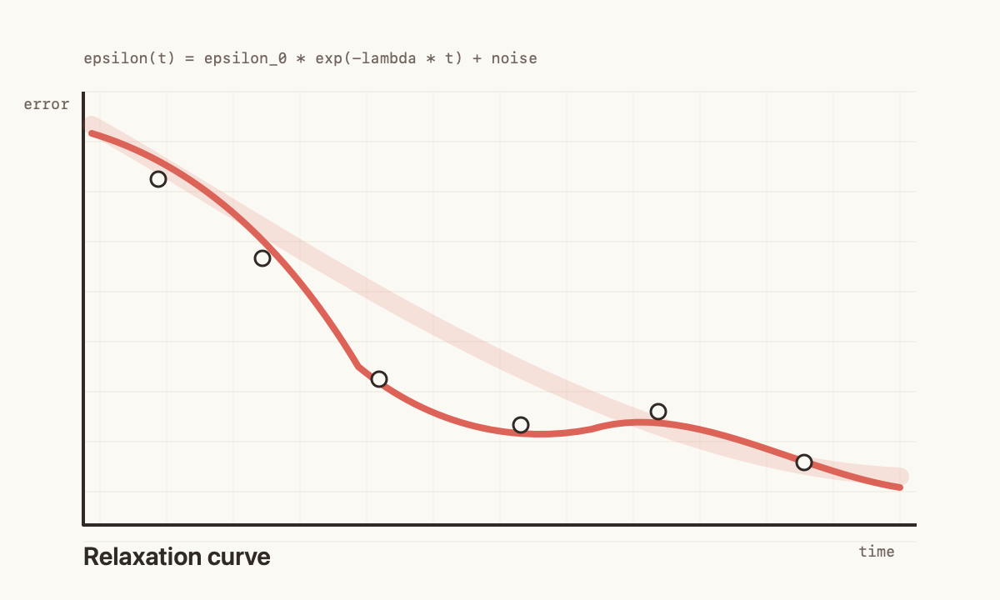

# A Small Note on Quiet Rendering

Kuma Technical Series

## Abstract

This note describes a tiny rendering model for printable Markdown documents. The model has no browser runtime, no HTML template, and no CSS cascade. It treats the page as a sequence of blocks and places each block with a small number of typographic constants.

The goal is not to compete with full publishing systems. The goal is to preserve a calm rhythm for notes, essays, reports, and internal papers where the shape of the page matters more than the machinery behind it.



## Model

Let the document be a finite sequence of blocks:

```text
D = [b_1, b_2, ..., b_n]
```

Each block consumes vertical space on an A4 page. A renderer walks the sequence from top to bottom, starting a new page whenever the next block would cross the lower margin.

For a paragraph with measured line count `L`, the height is approximated by:

```text
height(paragraph) = L * line_height
```

For an image with natural size `(w, h)`, the renderer preserves aspect ratio and clamps the rendered size to the current column:

```text
scale = min(column_width / w, max_image_height / h, 1)
draw_width = w * scale
draw_height = h * scale
```

## Reference Implementation

The core loop is intentionally boring:

```swift
for block in blocks {
    if block.wouldCrossPage(at: cursor) {
        beginPage()
    }

    draw(block, at: cursor)
    cursor.advance(by: block.height)
}
```

That is the whole trick. The implementation can remain small because it does not need to answer every layout question. It only needs to answer the questions this document style asks.

## Observations

- Headings benefit from a large gap before the block, not after it.
- Code reads better inside a shallow warm box than inside a heavy frame.
- Images should carry captions, but captions should not dominate the page.
- The renderer should fail softly when an asset is missing.

## Conclusion

Small renderers are useful when they choose a narrow surface and keep it coherent. The output should feel like a printed note, not a webpage frozen onto paper.
