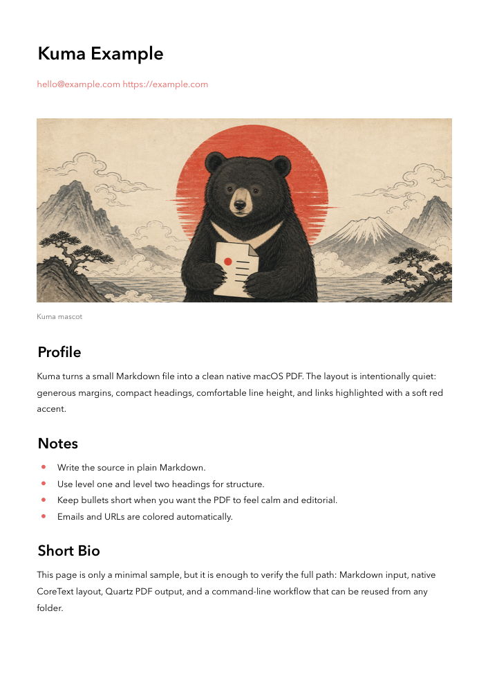
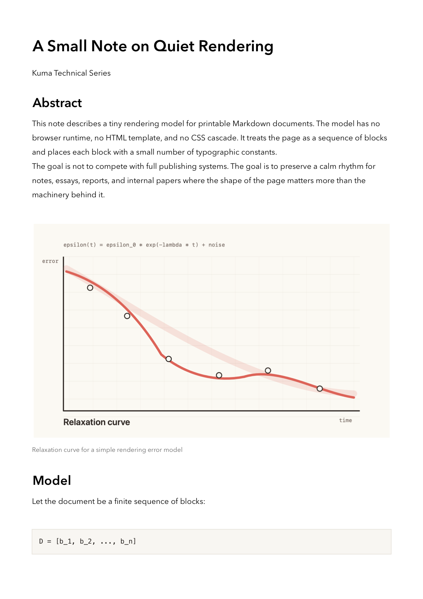
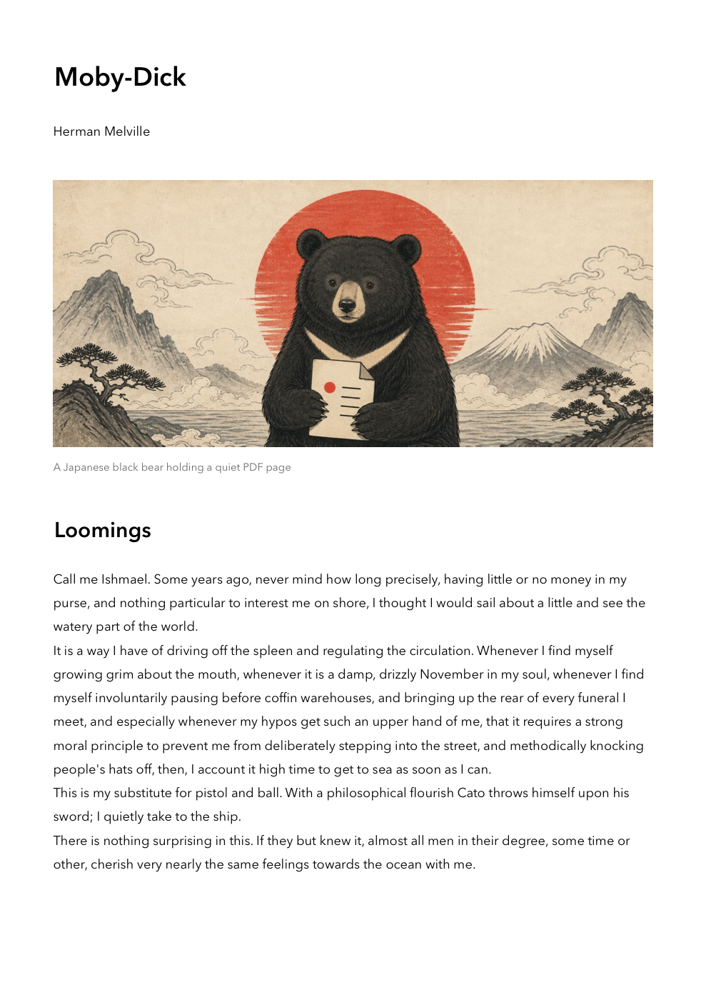
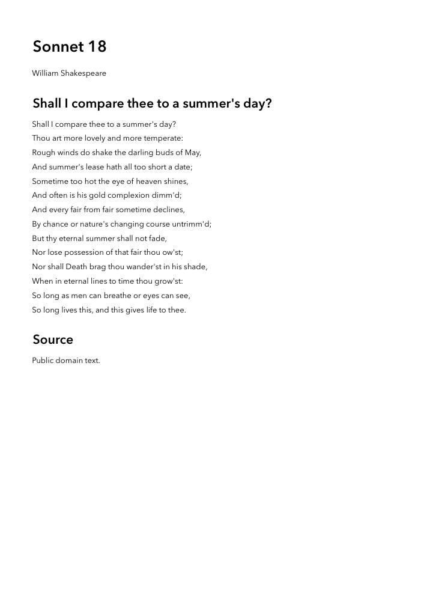
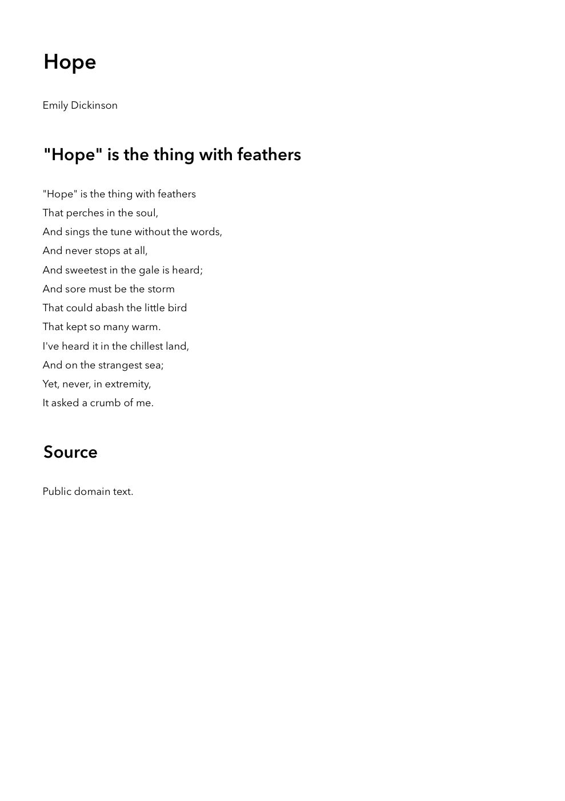
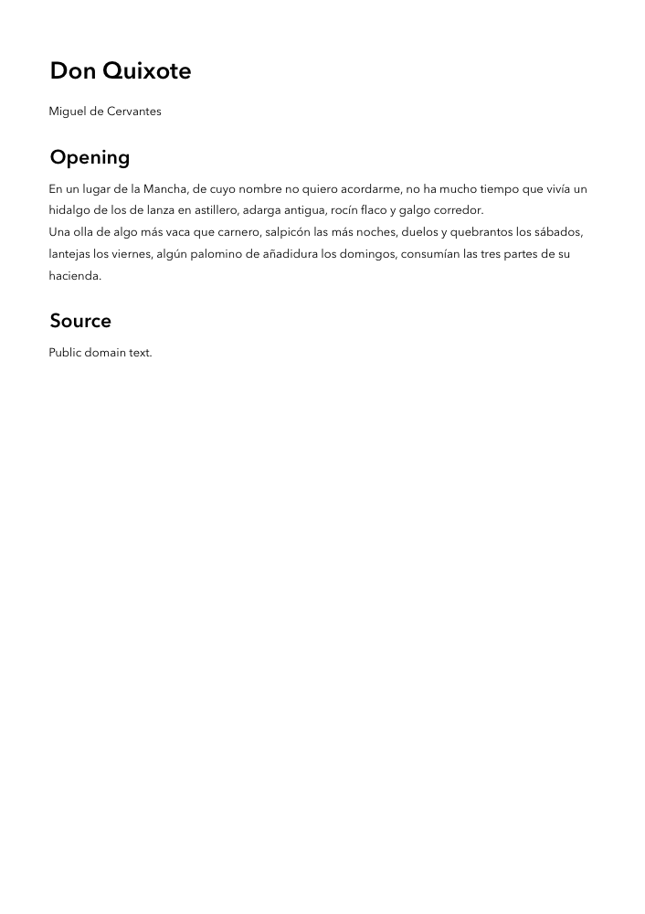
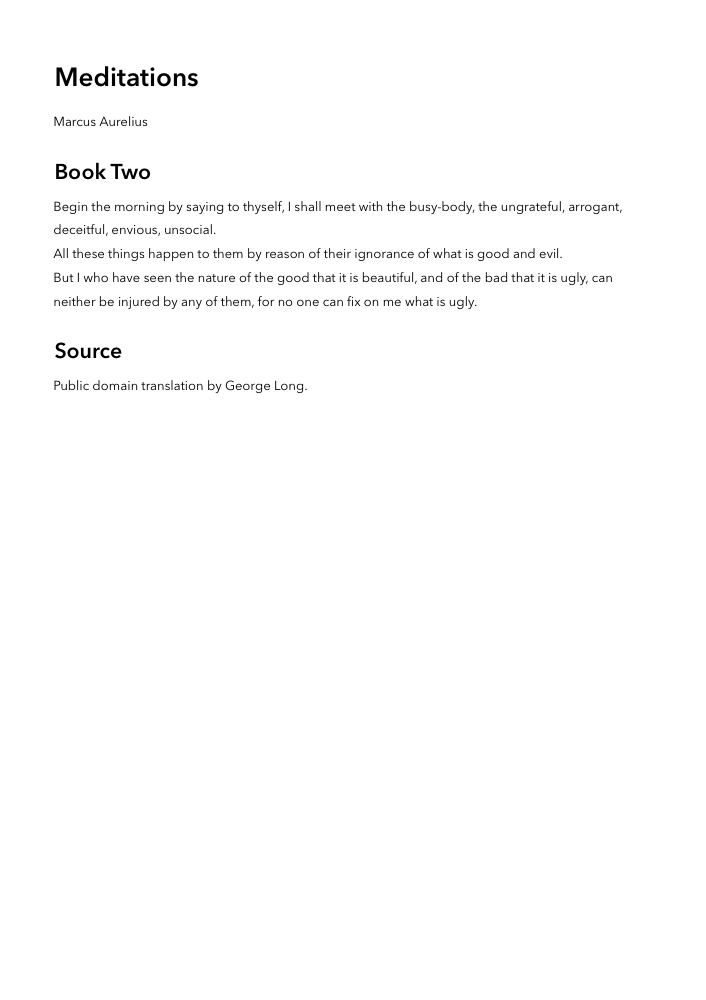

<p align="center">
  
</p>

<h1 align="center">Kuma</h1>

<p align="center">
  A tiny native Markdown-to-PDF renderer for macOS.
</p>

<p align="center">
  <code>brew install subirats345/tap/kuma</code>
</p>

<p align="center">
  
  
  
</p>

Kuma is deliberately small: plain Markdown in, quiet A4 PDF out. It uses CoreText, ImageIO, and Quartz directly, so there is no browser, HTML layer, server runtime, or template engine involved.

The goal is not to support every Markdown extension. The goal is to make simple documents feel calm, native, and printable.

## Install

With Homebrew:

```sh
brew install subirats345/tap/kuma
```

From source:

```sh
git clone https://github.com/subirats345/kuma.git
cd kuma
./Scripts/install-local.sh
```

Or build it manually:

```sh
swift build -c release
install -m 755 .build/release/kuma ~/.local/bin/kuma
```

## Usage

```sh
kuma
kuma interactive
kuma input.md
kuma input.md output.pdf
kuma input.md -o output.pdf
kuma input.md --open
```

If no output path is provided, Kuma writes a `.pdf` next to the input Markdown file.

The short alias is installed as `ku`:

```sh
ku Examples/basic.md
```

Run Kuma without arguments for a small interactive flow. It lists Markdown files in the current folder, lets you choose an input, suggests the output PDF path, and asks whether to open or watch the result:

```sh
kuma
```

Create a starter Markdown file:

```sh
kuma init
kuma init notes.md
```

Watch a Markdown file and re-render the PDF whenever it changes:

```sh
kuma watch notes.md
kuma watch notes.md notes.pdf --open
```

## Codex Skill

Kuma ships with a reusable Codex skill at [`skills/kuma-pdf`](skills/kuma-pdf). It tells an agent how to write Kuma-friendly Markdown, render the PDF, generate a first-page PNG preview, and check spacing, images, lists, and code blocks.

Install it into your local Codex skills folder:

```sh
mkdir -p "${CODEX_HOME:-$HOME/.codex}/skills"
cp -R skills/kuma-pdf "${CODEX_HOME:-$HOME/.codex}/skills/"
```

Then invoke it from Codex:

```text
Use $kuma-pdf to turn this Markdown note into a polished PDF and verify the preview.
```

## Examples

The examples are intentionally made from public-domain texts, so the repository stays easy to share.

| Source | Rendered PDF preview |
| --- | --- |
| [`Examples/basic.md`](Examples/basic.md) |  |
| [`Examples/technical-note.md`](Examples/technical-note.md) |  |
| [`Examples/moby-dick-loomings.md`](Examples/moby-dick-loomings.md) |  |
| [`Examples/shakespeare-sonnet-18.md`](Examples/shakespeare-sonnet-18.md) |  |
| [`Examples/dickinson-hope.md`](Examples/dickinson-hope.md) |  |
| [`Examples/cervantes-quixote.md`](Examples/cervantes-quixote.md) |  |
| [`Examples/aurelius-meditations.md`](Examples/aurelius-meditations.md) |  |

Render all examples locally:

```sh
mkdir -p .build/examples
for md in Examples/*.md; do
  kuma "$md" ".build/examples/$(basename "$md" .md).pdf"
done
```

## Markdown Support

Kuma currently supports the small subset needed for calm documents:

- `#` through `######` headings
- paragraphs
- unordered lists with `-` or `*`
- local images with ``
- fenced code blocks
- automatic accent coloring for emails and `http` or `https` URLs

Unsupported Markdown is treated as plain text. That keeps the renderer predictable while the project is still small.

## Development

```sh
swift build
swift run kuma Examples/basic.md .build/kuma-example.pdf
swift run kuma init .build/kuma-example.md
swift run kuma watch .build/kuma-example.md .build/kuma-example.pdf
swift build -c release
```

Kuma is dependency-free. The only requirement is macOS with SwiftPM.
